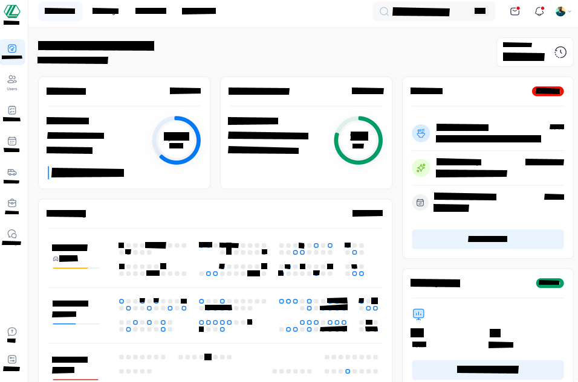
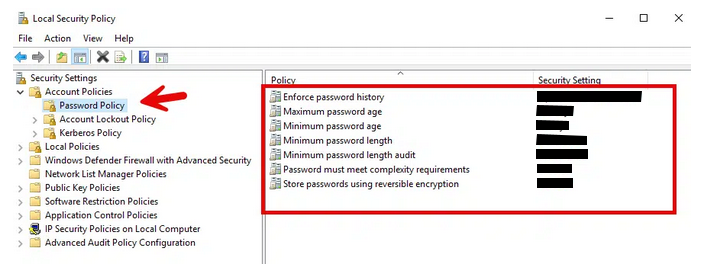

:::note
This is a fictitious project proposal I did for my final semester at university. Any relation to a real company or scenario is purely coincidence.
:::

## Summary
Synecdoche is a film production company based in Baltimore, MD. The company was founded in 1995 and has seen steady growth yearly. This past year, they eclipsed the 600-employee mark. Executives started to notice increased cyber incidents at Synecdoche, and they wanted to investigate the root cause of these incidents and what steps they could take to mitigate them.
After an internal investigation and research, Synecdoche executives discovered three key issues directly contributing to the cyber incidents. Due to a lack of any employee security awareness training, Synecdoche employees were subject to threats from phishing emails and general web-surfing malpractice.  No password policy was enforced, so most users had passwords that should have expired or had passwords that were not complex enough to be considered secure. Since there is no internal cybersecurity department at Synecdoche, many of these incidents slipped under the radar and gave the company executives a false sense of security.

Synecdoche implemented a software service that housed a knowledgebase for all things related to information security. This software also included a dashboard for end-users to track their usage and see where they ranked among their coworkers. Additionally, there was an administrative dashboard where the cybersecurity staff could monitor employees who needed additional information and security training guidance. Finally, a module allowed the cybersecurity staff to send phishing email campaigns to test employees. This software implementation reduced the number of cyber incidents caused by phishing emails and careless web browsing behavior.

Synecdoche implemented a new password policy that strictly defined how long a user’s password would be valid and clearly stated the parameters required for a password to be accepted. This implementation reduced the number of employee account breaches by external threat actors.

Synecdoche created a new Cybersecurity department that included a Chief Information Security Officer (CISO), Security Analyst, Network Security Engineer, Incident Response Manager, and Security Awareness Coordinator. This new department assisted with enforcing new security policies and kept Synecdoche up-to-date on industry-standard practices and procedures, further reducing the number of cyber incidents.

## Review of Other Work
Account breaches can cause massive damage to a company in many ways. For one, breaches can cause direct harm to your employees by exposing any personally identifiable information (PII) they may have stored on their employee account. Secondly, account breaches can cause financial damage to the company. This scenario could occur when the attacker steals banking information, invoices, or other financial documents. This could also occur simply by the public or customers finding out that there was a breach, and then those people lose all trust in the company. “A data breach could damage your company’s reputation, making it difficult to attract new customers or partners” (Renders, 2022).

When Synecdoche set out to implement a security awareness training program for all their employees, they wanted to ensure that it was not just giant walls of text that their employees would get bored of. If that were accurate, the training program would fall short of Synecdoche’s expectations for lowering the number of incidents caused by phishing and malware. “Using real-world examples and scenarios makes training more engaging, accessible and relatable. The best corporate security awareness training programs tailor training modules to mimic daily incidents your employees may face” (Infosec Institute, 2023).

Hiring an external cybersecurity consultant for security audits and projects can have benefits. They often have more experience than your standard cybersecurity professional and bring a broader perspective on fixing an issue or achieving a goal. That said, external cybersecurity consultants come at a high price, and a company must pay that high price whenever they need assistance with a cybersecurity-related issue or project. “Internal advisors can count on existing relationships with the client’s leadership structure (in effect their bosses) and workforce (in many cases their colleagues). These established lines of communication can prove invaluable in project management and maximizing efficiency” (Consulting.us, 2024).

## Original Project Environment
### Security Awareness Training Application
There is nothing in place to train employees on cyber security awareness. Due to nothing in place, Synecdoche is experiencing many cyber incidents due to ignorant employee behavior. To solve this problem, a security awareness training application will be implemented on the company’s intranet. This application will serve as a knowledgebase for all employees to learn about best practices for surfing the web, being weary of phishing emails, and reporting suspicious activities to the correct authorities. The application will also feature a phishing email simulator where the Cyber Security Department can send phishing email campaigns to all employee mailboxes. Finally, the application will include a dashboard for users and administrators so that employee participation can be tracked and employees in bad standing can be notified and instructed to correct their mistakes to return to good standing.

### Updated Password Policy
The current password policy at Synecdoche is severely outdated and has not been enforced by any entity. Due to no strict password policy, the employees are subject to brute-force attacks where an attacker can use a computer program to crack an employee’s password with relative ease. By implementing a stricter password policy that includes a maximum password age of 120 days, a minimum of 10 characters, including at least 1 uppercase letter, at least 1 number, and at least 1 symbol, an attacker would need five years to crack a Synecdoche employee password.

### Creation of Cybersecurity Department
There is currently no internal Cybersecurity Department at Synecdoche. Due to the lack of a cybersecurity department, there is no governing body to enforce policies to protect company data. If Synecdoche executives want to make meaningful changes, they need to hire an external consultant, which would cost significant money and only provide short-term benefits. By creating an internal Cybersecurity Department at Synecdoche, there will be experts to create, apply, update, and enforce security policies that keep Synecdoche employees and data safe. This new department will require a significant upfront cost, but over time, Synecdoche will save money by not resorting to external consultants for cybersecurity needs.

## Changes to the Project Environment
Synecdoche executives decided to put together a document sent via email to all employees that entailed very general and basic material on how to keep an eye out for phishing emails and how to browse the web more safely. This basic training document was thought to suffice while the main Security Awareness Training Application was being developed. After the project ended, the Cybersecurity Department went back to look at incident logs to see if there was any significant decrease after this document was sent out. Sadly, that was not the case. There was no difference between cyber incidents before and after the training document was sent out.

Nothing of note has changed regarding the implementation of the new password policy and the creation of the Cybersecurity Department.

## Methodology
The ADDIE Methodology was used for this project as it checks many boxes for all three projects Synecdoche attempted to implement. The ADDIE methodology consists of 5 phases: Analysis, Design, Development, Implementation, and Evaluation.

The analysis phase was completed relatively quickly since the executives had already found the root causes of their issues.

The design phase was completed once the project members agreed on the three processes that would most increase Synecdoche’s security posture. The three processes that were chosen were designed as follows:
1.	Security Awareness Training Application
    -	Web application hosted on Synecdoche intranet
    -	Knowledgebase containing educational materials on common cyber incidents and how to avoid them
    -	Phishing email campaign module that allows Cybersecurity staff to send test phishing emails to unsuspecting employees
    -	A user dashboard will help employees visualize their educational progress and where to improve
    -   Admin dashboard to keep track of employees that are in bad standing and could use supplemental training/education
2.	Password Policy Update
    -	Maximum password age of 120 days
    -	Minimum of 10 total characters
    -	Must include at least 1 uppercase letter, 1 number, and 1 symbol
    -	Must not include:
        -	Username
        -	First or Last name
        -	Date of Birth
        -	Any 10 previous passwords
3.	Cybersecurity Department
    -	Chief Information Security Officer
        -	Strategic planning, policy management, compliance oversight
    -	Security Analyst
        -	Threat analysis, security audits, penetration testing
    -	Network Security Engineer
        -	Firewall management, intrusion detection systems, VPN management
    -	Incident Response Manager
        -	Incident investigation, incident containment, recovery, forensic analysis
    -	Security Awareness Coordinator
        -	Designing and implementing training programs, evaluating training effectiveness

The development phase consisted of the programmers at Synecdoche creating the Security Awareness Training Application and dashboards for end-users and administrators. Next, the CISO created the updated password policy to meet the abovementioned parameters. Lastly, the CISO and the Human Resources Department worked together to develop a job listing for the four remaining roles in the Cybersecurity Department.

The implementation phase kicked off once the training application development was completed, the password policy was created, and all four roles were filled in the Cybersecurity Department. The training application was hosted on a Synecdoche-owned web server and accessible via the company’s intranet. Once the application was up and running, the Marketing Department updated the Synecdoche website so employees could access the new application. Next, the newly created password policy was applied to the Synecdoche active directory service and immediately enforced on all company devices/applications. Lastly, the newly hired cybersecurity staff members were onboarded and trained in their new roles and responsibilities.

Lastly, the evaluation phase consisted of a meeting at the end of the project to discuss any issues or successes each team encountered. After that, there were meetings once per quarter to discuss the effectiveness of the training application, password policy, and the Cybersecurity Department.

## Project Goals & Objectives
| |Goal|Objectives|Deliverables|Met?|
|:----|:----|:----|:----|:----|
|1|Improve Security Awareness at Synecdoche|1. Educate employees on common cyber-attacks and their causes|1. Create a web application with a knowledgebase of common cyber-attacks and how to avoid them|Yes|
| | |1a. Allow end-users and administrators to track usage data|1a. Create a dashboard that allows employees to their training history and visualize where they can improve|Yes|
| | | |1b. Create a dashboard that allows Cybersecurity staff to see employee usage data to see who may need extra training material|Yes|
|2|Limit employee account breaches|2. Update the password policy to current industry standards|2. Create a new password policy that combats brute-force attacks|Yes|
| | |2a. Utilize the new Security Awareness Training Knowledgebase|2a. Refer employees to the security awareness knowledgebase after a failed password creation failure|No|
|3|Establish an internal Cybersecurity Department at Synecdoche|3. Develop a comprehensive cybersecurity strategy that includes risk assessment, threat management, and incident response tailored to the company's specific needs|3. Cybersecurity Policy Document outlining protocols, employee responsibilities, and guidelines for managing cyber risks and incidents|Yes|
| | |3a. Hire and train a skilled cybersecurity team equipped to handle the company’s specific security needs and compliance requirements|3a. A fully staffed and operational cybersecurity department with necessary tools, technologies, and processes in place for continuous monitoring and threat mitigation|Yes|

### Project Goals & Objectives Descriptions
1.	**Goal 1: Improve Security Awareness at Synecdoche**
    
    This goal was met by providing interactive educational materials to all employees at Synecdoche.
    -	**Objective 1: Educate employees on common cyber-attacks and their causes**
    
        This objective was met because Synecdoche software programmers created a web application with a knowledgebase of common cyber-attacks and how to avoid them.
    -	**Objective 1a: Allow end-users and administrators to track usage data**
    
        This objective was met because Synecdoche software programmers developed both an end-user and administrator dashboard so that application usage data could be tracked and acted upon.
2.	**Goal 2: Limit employee account breaches**

    This goal was met because of companywide policy changes that hardened the security at Synecdoche.
    -	**Objective 2: Update the password policy to current industry standards**
    
        This objective was met after the new Chief Information Security Officer created a new password policy and applied it to the company’s active directory service.
    -	**Objective 2a: Utilize the new Security Awareness Training Knowledgebase**
    
        This objective was not met due to time constraints during the project. It was decided that the focus should be on the end-user and administrator dashboards.
3.	**Goal 3: Establish an internal Cybersecurity Department at Synecdoche**

    This goal was met by creating five new roles and hiring five cybersecurity experts at Synecdoche.
    -	**Objective 3: Develop a comprehensive cybersecurity strategy that includes risk assessment, threat management, and incident response tailored to the company's specific needs**
    
        This goal was met by creating a cybersecurity policy document that outlines protocols, employee responsibilities, and guidelines for managing cyber risks and incidents.
    -	**Objective 3a: Hire and train a skilled cybersecurity team equipped to handle Synecdoche’s needs and compliance requirements**
    
        This objective was met by creating a fully staffed and operational cybersecurity department at Synecdoche.

## Project Timeline
|Milestone |Planned Dur|Actual Dur|Projected Start Date|Anticipated End Date|Actual Start Date|Actual End Date|
|:----|:----|:----|:----|:----|:----|:----|
|Meeting – Project Start|3h|5h|10/01/2024|10/01/2024|10/01/2024|10/01/2024|
|Hiring four employees for the Cybersecurity Department|30d|35d|10/01/2024|11/15/2024|10/01/2024|11/22/2024|
|Creation of a new Password Policy|1d|1d|10/01/2024|10/01/2024|10/01/2024|10/01/2024|
|Meeting - Requirements of Security Awareness Training Application|3h|4h|10/02/2024|10/02/2024|10/02/2024|10/02/2024|
|Development of Security Awareness Training Application|21d|40d|10/02/2024|11/01/2024|10/02/2024|12/04/2024|
|Development of End-User Dashboard|7d|12d|11/01/2024|11/14/2024|12/04/2024|12/20/2024|
|Development of Administrator Dashboard|7d|10d|11/14/2024|11/25/2024|12/20/2024|01/07/2025|
|Development of Phishing Campaign Module|7d|12d|11/25/2024|12/06/2024|01/07/2025|01/24/2024|
|Creation of Cybersecurity Policy Document|14d|17d|12/06/2024|12/27/2024|01/24/2025|02/19/2025|
|Creation of Knowledgebase articles for Security Awareness Training Application|10d|13d|12/27/2024|01/13/2025|02/19/2025|03/10/2025|
|Implementation of Security Awareness Training Application on Synecdoche web server|2d|1d|01/13/2025|01/15/2025|03/10/2025|03/11/2025|
|Test functionality of Security Awareness Training Application|1d|1d|01/15/2025|01/16/2025|03/11/2025|03/12/2025|
|Send emails to all employees regarding new applications, policy updates, and Cybersecurity Dept|1h|1h|01/16/2025|01/16/2025|03/13/2025|03/13/2025|
|Meeting – Project End|3h|3h|01/17/2025|01/27/2025|03/14/2025|03/14/2025|

The project took about a month and a half longer than anticipated. This was mostly due to the wishful thinking that developing the Security Awareness Training Application would take less than 2 months to complete. That part of the project alone took 74 days to complete, leading to considerable delays on parts that could not start until that application was finished. On top of that, scheduling a massive project like this during the holiday season was a massive oversight. Time off due to federal holidays and employees taking PTO during the project also caused delays, but that can be attributed to the executive’s decision to rush this project and not wait until the new year to begin.

## Unanticipated Requirements
The software programmers were under a heavy load during the project and quickly fell behind schedule. An example of this was their first task of developing the security awareness training application. This was anticipated to take only 21 days, but it took the programming team 40 days to complete. This setback caused the upper management team to meet and discuss ways to get back on track. It was decided that the deliverable of “development of a password creation failure error message that points to the knowledgebase” would be cut from the project scope to save time and energy and focus on more important tasks. Besides that, no other requirements were brought to the team during development, and no other deliverables were cut from the project scope.

## Conclusion
Synecdoche undertook a massive 3-part project that created a Security Awareness Training Application, implemented a new password policy, and established a new 5-person Cybersecurity Department. The new department developed a strategic plan that included updated policies and procedures for handling all cyber incidents. As a result of creating this department, Synecdoche saw its Mean Time to Detect (MTTD) decrease by 30%. In other words, the Cybersecurity Department detected incidents much faster than before, allowing for quicker containment and eradication. The new Security Awareness Training Application was a massive success. Employees utilized the knowledgebase system to learn more about current threats and how to avoid them. The phishing campaign system significantly boosted the company’s security posture, enabling end-users to recognize telltale signs of phishing attacks, such as spelling errors, unrecognized email addresses, and masked hyperlinks. With all these improvements, Synecdoche experienced up to a 50% reduction in incidents caused by human error. Finally, the new password policy delivered immediate results, significantly reducing the chances of a brute-force attack. For example, assuming a user’s old password was eight characters long with an uppercase letter and a number, the time required to crack that password increased from one hour to five years.

## Project Deliverables
[Appendix A](#appendix-a) shows what a cybersecurity administrator sees when logged into the Security Awareness Training Application administrator dashboard. From here, they can see what materials each employee has reviewed, topics they need to review more, and the results of phishing campaigns sent to them.

[Appendix B](#appendix-b) is a screenshot of the new security policy inside the Active Directory. This is exactly how the Chief Information Security Officer applied the policy that he created using the following parameters:
-	Maximum password age of 120 days
-	Must contain at least ten characters in total
-	Must contain at least one uppercase letter
-	Must contain at least 1 number
-	Must contain at least one symbol
-	Must not contain the following:
    -	Username
    -	First or Last Name
    -	Date of Birth
    -	10 previous passwords

## References
Consulting.us. (n.d.). External vs Internal Consultants. External vs internal consultants. https://www.consulting.us/consulting-industry/external-vs-internal-consultants

Infosec Institute. (2023, July 27). Optimizing your corporate security awareness training: Strategies and techniques. https://www.infosecinstitute.com/resources/security-awareness/optimize-corporate-security-awareness-training/

Renders, J. (2023, January 17). Why implementing a strong password policy is important for your business’s Data. Why Implementing a Strong Password Policy is Important for Your Business’s Data. https://brightlineit.com/why-implementing-a-strong-password-policy-is-important-for-your-businesss-data/

## Appendix A

## Appendix B
